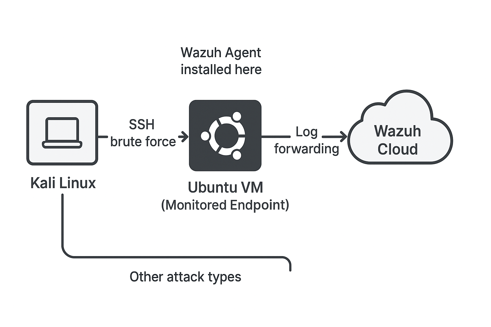

# SOC-Home-Lab

## 📖 Introduction
This project simulates a Security Operations Center (SOC) environment using **Wazuh Cloud** as the SIEM.  
I set up a monitored Ubuntu server with a Wazuh Agent, performed simulated attacks from a Kali Linux VM, and analyzed the resulting alerts.  

The goal was to gain hands-on experience with SIEM administration, detection engineering, and SOC analysis tasks.

---

##  Architecture

**Components:**
- **Kali Linux VM** → attacker machine (used for brute force, privilege escalation, and scanning tests).
- **Ubuntu VM (Monitored Endpoint)** → endpoint monitored with **Wazuh Agent installed here**.
- **Wazuh Cloud (SIEM)** → centralized logging, correlation, and alerting.
  
  


**Architecture flow**:
```plaintext
[Kali Linux (Attacker)]  →  [Ubuntu VM (Monitored Endpoint + Wazuh Agent)]  →  [Wazuh Cloud SIEM Dashboard]


